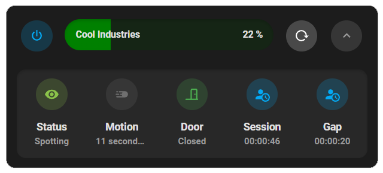

# YERP (Your Emergency Response Platform)

YERP! (Your Emergency Response Platform) is a privacy-focused, affordable platform for smart spotting of enclosed spaces for signs of potential opioid overdose and other medical emergencies.

It's also fully modular system, built on top of <a href="https://home-assistant.io">Home Assistant</a>, made to accommodate a wide variety of needs across different types of spaces, different accessibility needs, and different preferences for drug users, service providers and loved ones.

The files in this repo are the contents of the config folder from the Home Assistant installation YERP! is being built on. The focus so far has been building out a usable and reliable setup, before bundling everything down into an integration.

## Hardware tested & used so far

### Raspberry Pi 4B, 4GB memory
Used originally because of ease of access, pre-chip shortage. Used, decommissioned thin clients are an alternative currently being tested.

### Ecolink PIRZWAVE2.5-ECO
As many PIR sensors have motion buffers that are longer than pratically useful for many potential YERP! installs, this sensor was selected on account of its "test mode" dipswitch, with a five second motion buffer. Battery life is still excellent in test mode, lasting around 18 months.

### DIY PIR (built with an HC-SR501 and ESP8266)
These are certainly a lot more economical than the Ecolink sensors but require fabrication, along with printing up a case and wall power. 

### Wink Door Sensor, Sonoff Door Sensor, Sonoff Zigbee Button, Xiaomi Aqara Button, IKEA Tradfri Bulbs
Not much to say about these, they were picked for ease of access and work fine!

### Sonoff NSPanel
Under early development for using this wall switch panel as an interactive console. Working on this thing is a whole can of worms in and of itself, and may need to wait until other Home Assistant hackers put something together more extensible than the current offerings.

### XeThru X4M200
Researched and tested for potential use as a device that can directly monitor respiration over the air via radar. Which it can! But unfortunately, respiration detection only shows readings after a subject has already been still for around 30 seconds.. probably pretty useful for monitoring breath rate while sleeping, not that useful for this project (and at $250 per sensor, more expensive than some other builds top to bottom).

### Wyze Cam v3 
Used as a webcam for the demo install. (Actual installations don't include any audio or video recording)